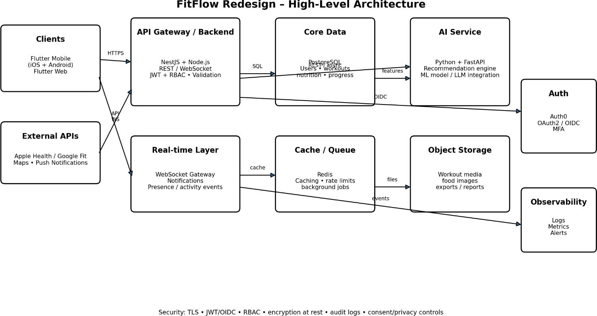
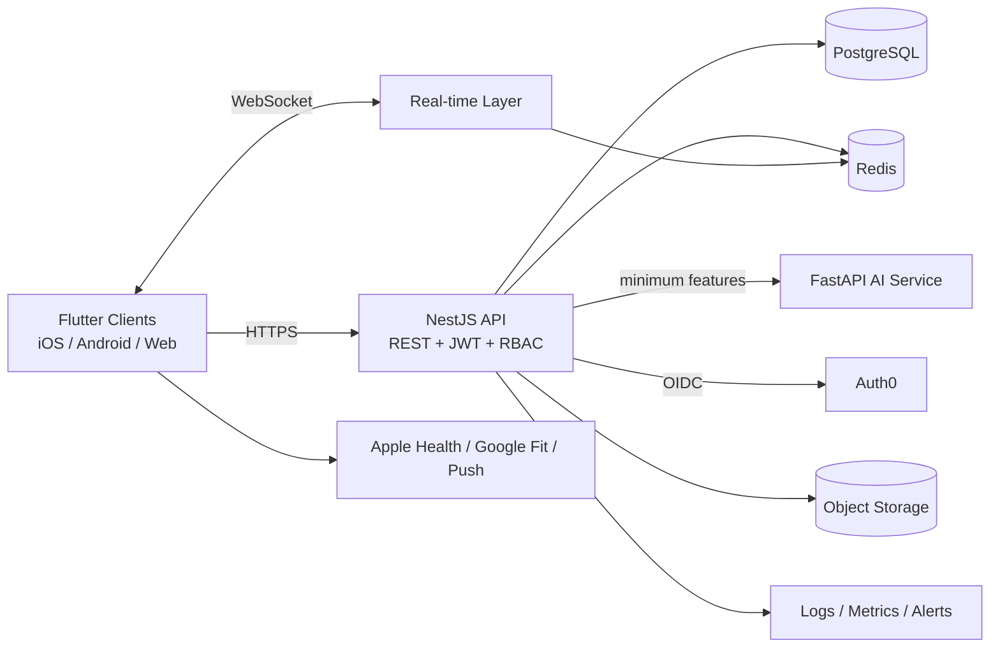

# High-Level Architecture

## Components
- **Clients:** Flutter app for iOS, Android and web.
- **API:** NestJS – validation, RBAC, business logic, REST + WebSockets.
- **AI service:** FastAPI – workout recommendation and nutrition estimation, scaled independently.
- **Database:** PostgreSQL – system of record.
- **Cache/queue:** Redis – dashboards, rate limiting, background jobs.
- **Auth:** Auth0 via OAuth 2.0 / OIDC with MFA.
- **Storage:** S3-compatible for images and exports.

## Critical data flows
**Personalized workout plan:** Flutter → NestJS → PostgreSQL (profile/history) → AI service (minimum required features) → recommendation → NestJS validates and stores plan → Flutter displays plan.

**Social sharing:** Flutter → NestJS → RBAC check → PostgreSQL stores post/reaction/follow → WebSocket event published → connected users updated in real time.

**Nutrition tracking:** Flutter captures meal data → NestJS validates → PostgreSQL stores records → AI optionally estimates recommendations → cached summaries returned to dashboard.

## Security, scalability, integration
- TLS everywhere; OIDC/JWT identity; RBAC; server-side authorization on every protected operation.
- Encryption at rest; secrets in a managed secrets store.
- PostgreSQL indexes, partitioning of large activity tables, read replicas, PITR backups.
- Redis for caching, rate limiting, job coordination.
- NestJS scaled horizontally behind a load balancer; AI service scaled separately (CPU/GPU).
- Privacy by design: data minimisation, consent records, export/deletion, audit logs.
- Shared API contracts via OpenAPI.
